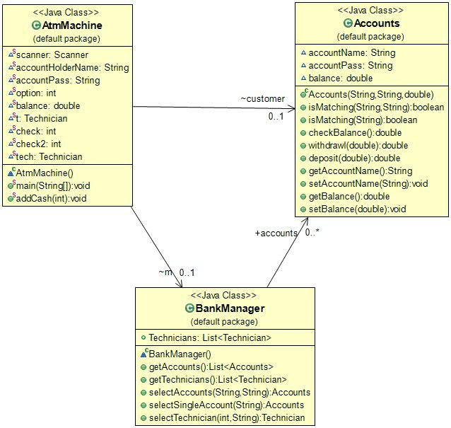
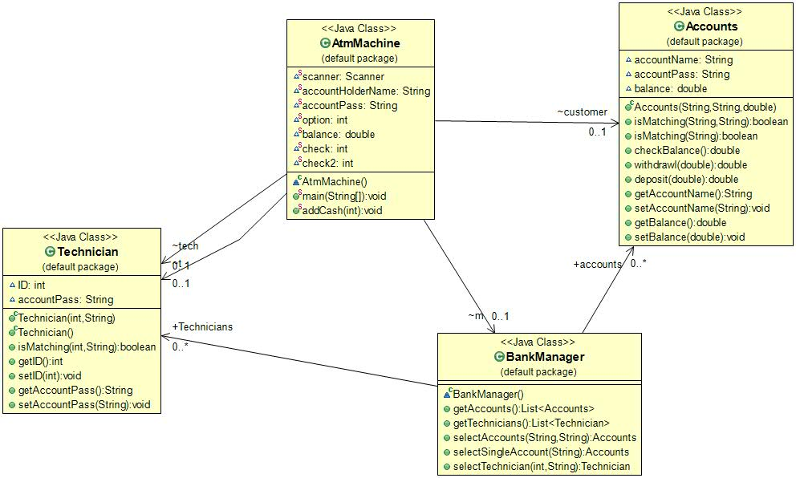

An automated teller machine (ATM) or the automatic banking machine (ABM) is a banking subsystem (subject) that provides bank customers with access to financial transactions in a public space without the need for a cashier, clerk, or bank teller.
There are two roles from which ATM can be used :
-	User/client
-   Technician

Both of actors interaction with ATM is managed with bank manager actor who stores record of both actors, user and technician.
```java
	public List<Accounts> getAccounts(){
		//list of accounts from database
		return Arrays.asList(new Accounts("Shariq","qwerty",10000),
				new Accounts("Yasir","qwerty1",1000),
				new Accounts("Anas","qwerty2",900));
	}
	
	public List<Technician> getTechnicians(){
		//list of technicians from database
		
		return Arrays.asList(new Technician(124431,"qwerty"),
				new Technician(242431,"abc123"),
				new Technician(263118,"qwaszx"));
	}
```
More record can be added as per need. 

In a real world it user operates with ATM card and user personal pin. User enters card and pin to access its account using ATM and perform his or her desired tasks. User can withdraw , deposit funds to his or her account and check balance and transfer funds using ATM. In a real world user use plastic ATM card but I have consider user account name/ID as alternative for user ATM card for a software or console base application. Also in a real world technician interacts with ATM directly but to show similar behavior I have user two options whenever ATM application starts , user and technician login. Technician can add more cash to ATM and also he can repair and do relevant services with ATM. Obviously we can show repair or any other function in a software application, technician can only ass cash to application.	


Class Diagram for only User interaction:


 
There are three classes, ATM machine class handles ATM functions and is main class of application. It can have zero or many customers which are in Accounts class. User can only be manage by 1 bank actor or manager which keeps record of accounts of clients and validate accounts whenever user interact with ATM machine.
```java
public Accounts selectAccounts(String accountName,String accountPassword){
		for (Accounts account:accounts){
			if(account.isMatching(accountName, accountPassword)){
				System.out.println("Matched, Welcome "+accountName+"Your balance is "+account.balance);
				return account;
			}
		}
		System.out.print("Not Matched");
		return null;
	}
 ```   
Accounts class object is use for interaction of client with ATM. It keeps record of user balance when user interacts with ATM. 


Class diagram with Technician actor:

 

All classes are same with addition of Technician class. Technician can add more cash to ATM. ATM has pre define amount of cash when application starts, user cant withdraw more cash then available cash in Atm. ATM machine can manage by 1 technician. Bank can have many or more technicains.
